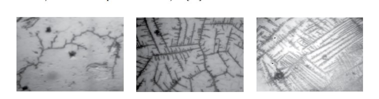
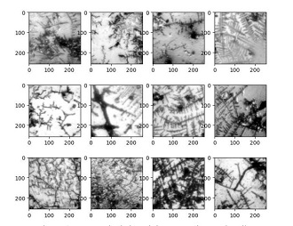
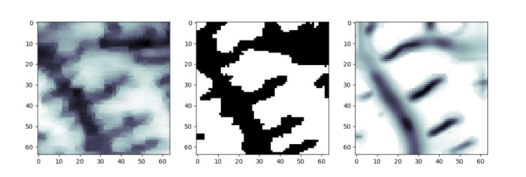
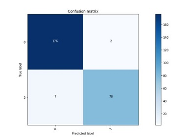
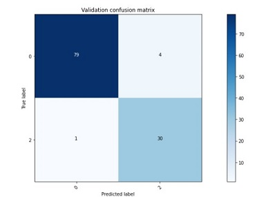

# PyProject
## Introduction
A lot of women worldwide have infertility problems or undesired pregnancies. The number of abortions is really high so in order to prevent such a situation, this work is suggesting a useful way in birth control. Monitoring the level of estrogen in woman’s body can say a lot of their menstrual cycle. The method proposed is the usage of saliva analysis.
Furthermore, I will present my approach according to the problem.
## Implementation
The idea behind the project is to classify images based on saliva images. That is because you can detect the level of estrogen in saliva crystallization. So it should appear a ferning pattern when it's a high level of estrogen. You can see in the image below: 1st - no ferning image, 2nd - semi-ferning images, 3rd - full ferning images. I will clasify the images from my database using k-means (for feature extraction) and support vector machine.

### Image acquisition
Saliva samples were collected every morning and pictures were taken using a microscope and its camera. After that, the second step was to process those samples. Here you have some samples from the database.

### Image processing
1. Grayscale conversion
2. CLAHE (Contrast Limited Adaptive Histogram Equalization) 
3. Binarization
4. Frangi filter
5. Local Binary Pattern - for extracting the characteristics

In the bellow images you can see: (1) Original Image; (2) Binar image; (3) Frangi filtered image

## Following the Bag-of-Words 
### - K-Means Algorithm and vocabulary construction
### - Words Assignemnt => Set of codewords
### - Computing Histogram
### - Image Classification using Support Vector Machine
## Results
### Training
In the test part, the accuracy was really high, about 97%.You can see in the confusion matrix below.

### Testing
In the test part, a smaller set was used. The accuracy resulted as 96% where 5 out of 114 images were predicted wrong.

#Work in progress...
New approach!
